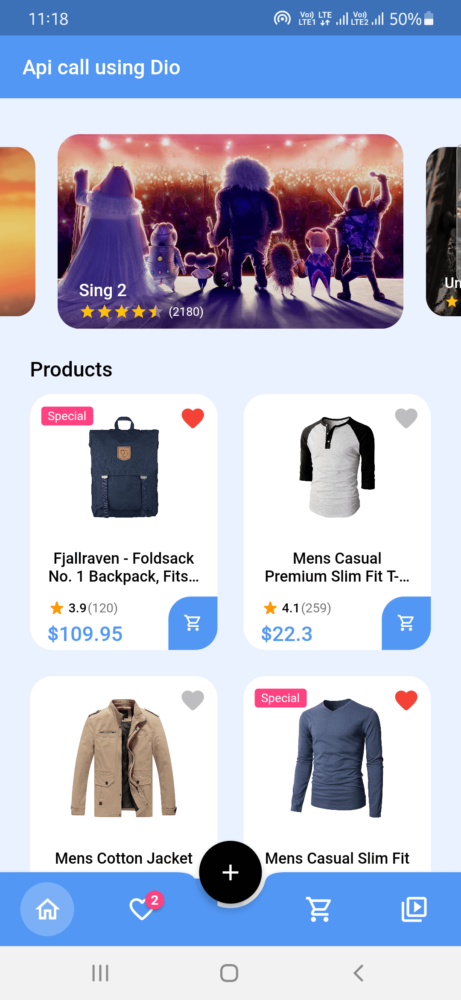
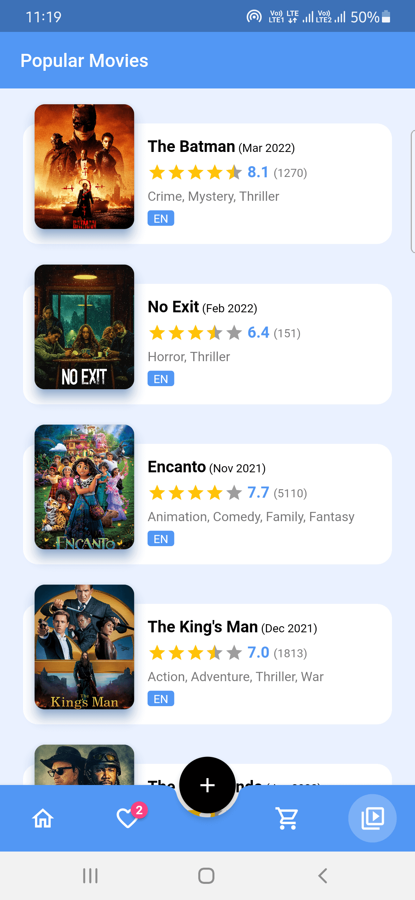

# API call demo

## Get The APK:

  
## Preview

**Screenshots**

  

## Packages used
* [Dio](https://pub.dev/packages/dio) - Api calling
* [GetX](https://pub.dev/packages/get) - State management
* [ScreenUtil](https://pub.dev/packages/flutter_screenutil) - Responsive app 
* [Extended Image](https://pub.dev/packages/extended_image) - Cache images and more
* [Badges](https://pub.dev/packages/badges)
* [Spinkit](https://pub.dev/packages/flutter_spinkit)
* [Ratingbar](https://pub.dev/packages/flutter_rating_bar)
* [CarouselSlider](https://pub.dev/packages/carousel_slider)
* [Intl](https://pub.dev/packages/intl)
* [Connectivity](https://pub.dev/packages/connectivity_plus)
